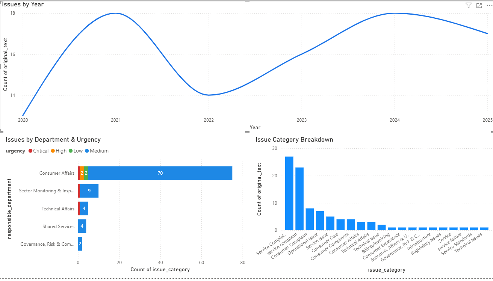

# ⚡ Saudi Electricity Regulatory Authority Feedback Classifier  
AI-powered NLP classifier using NVIDIA Llama 3.2 and LangChain.

This project processes user feedback related to the Saudi Electricity Regulatory Authority and returns structured JSON including translation, sentiment, responsible department, urgency, and issue category. All outputs are logged automatically into a CSV file for analytics and Power BI dashboards.

---

## 🚀 Features

- **Automatic Language Detection**
- **Contextual Arabic → English Translation**
- **Sentiment Analysis** (positive, neutral, negative)
- **Responsible Department Classification**  
  Based on the official organizational structure:
  - Communication & Media  
  - Governance, Risk & Compliance  
  - Strategy & Excellence  
  - Sector Monitoring & Inspection  
  - Shared Services  
  - Legal Affairs & Regulations  
  - Technical Affairs  
  - Economic Affairs & Licensing  
  - Consumer Affairs  

- **Urgency Classification**
  - Critical  
  - High  
  - Medium  
  - Low  
  - Positive  

- **Issue Category Classification**
  (Power outages, billing issues, safety violations, customer service issues, etc.)

- **Automatic CSV Logging**
  Output is appended to `feedback_log.csv`.

---

## 📦 Installation

```bash
pip install langchain-core langchain-nvidia-ai-endpoints pandas


## 📊 Dashboard Preview

Below is an example Power BI dashboard created using the generated `feedback_log.csv`:


